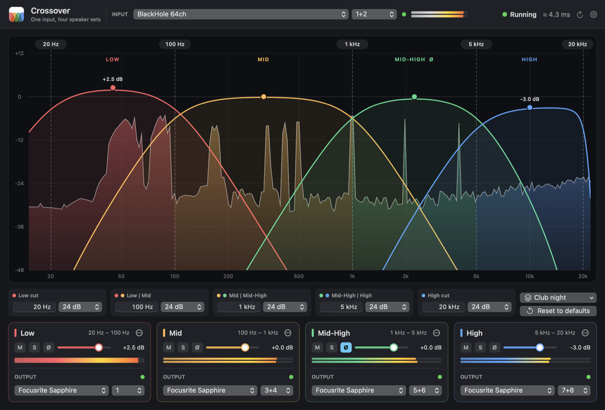
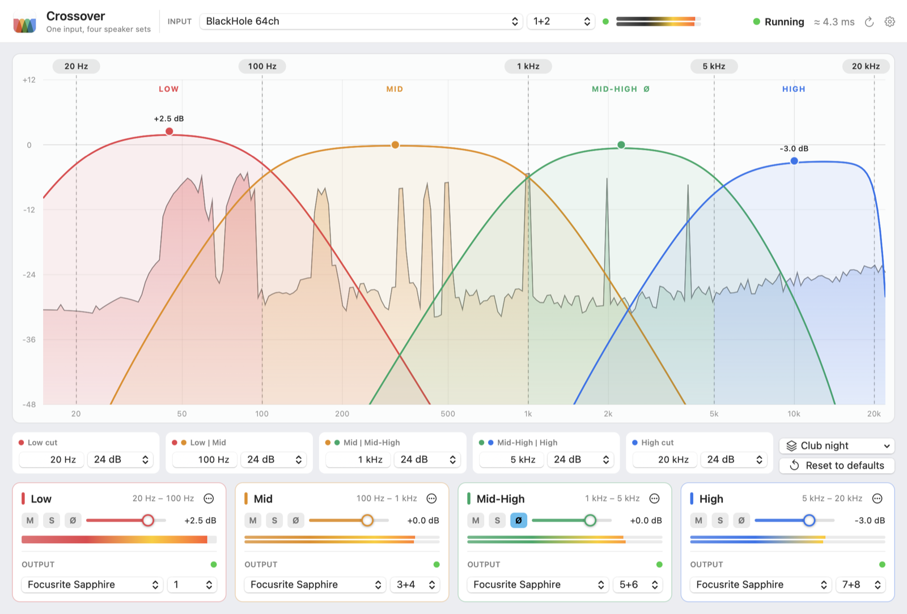

# Crossover v1.0





<sub>Rendered by the app itself (`--snapshot FILE --demo`, add `--light` for light mode):
BlackHole 64ch in, the four bands out to pairs of a 16-output interface, the Low
band mono to channel 1, the Mid-High band polarity-flipped.</sub>

A small Mac app that takes **one audio input**, splits it by frequency into
**four bands**, and sends each band to its **own speakers**, so every set gets only
what it's good at: the bass to the big speakers, no bass to the small ones.

| Band     | Default range     | Typical speaker            |
|----------|-------------------|----------------------------|
| Low      | 20 Hz – 100 Hz    | subwoofers                 |
| Mid      | 100 Hz – 1 kHz    | mid-bass / full-range      |
| Mid-High | 1 kHz – 5 kHz     | mid drivers                |
| High     | 5 kHz – 20 kHz    | tweeters / small speakers  |

Every crossover can be moved and its slope set from a gentle 6 dB to a near brick-wall
96 dB per octave. Bands you don't need can be deleted (a two-way sub/tops split is
two clicks), and the whole setup saved as a preset.

Created by Philip Warda and Soshiant Lak with the instrumental help of Claude Opus 5.0.
Built on the engine of [Audio Angel](https://github.com/philpiano/audio-angel).

**Why it exists.** macOS can send its sound to one device, or the same sound to
several, but it can't split it by frequency. Setting up a sub plus tops, or a
three- or four-way speaker rig, from a Mac normally means a DAW or a hardware DSP.
Crossover is that DSP: low latency, phase-correct, and simple enough to set once and
forget.

**Requirements:** macOS 13 Ventura or later, and Apple's Command Line Tools to build it
(`xcode-select --install`; no Xcode needed). To split what the Mac itself plays, a
loopback such as [BlackHole](https://github.com/ExistentialAudio/BlackHole).

---

## First time

**1. Get the code and build the app.**

```bash
git clone https://github.com/philpiano/crossover.git
cd crossover
./build.sh
```

That runs the engine's tests, then makes `build/Crossover.app`. Drag it to
Applications if you like.

**2. To split the Mac's own sound**, install a loopback and send the Mac's output
into it:

```bash
brew install blackhole-64ch
```

Log out and back in, then set the Mac's output to **BlackHole 64ch**
(System Settings › Sound). Everything the Mac plays now arrives there.

**3. Open Crossover** and allow microphone access when macOS asks (macOS treats every
audio input as a microphone, loopbacks too). Choose the input at the top, and an
output for each band at the bottom.

---

## Using it

**Input** (top): the device and channels to split: BlackHole 64ch, an interface's
inputs, anything with an input.

**The display** (centre): the input's live spectrum, coloured by the band each part
of it goes to, with each band's response drawn over it.
- Drag a crossover line left or right. **Double-click its label** along the top to
  type a frequency (`120`, `1.2k`, `2.5 kHz`).
- Drag a band's dot up or down to set its level. **Double-click the dot** for 0 dB,
  or **double-click the level** above it to type one.

**Edges** (under the display): every crossover's frequency and slope (6, 12, 24, 36,
48 or 96 dB per octave), plus a low cut and a high cut on the input, either of which
can be Off.

**Presets** (above Reset): *Save this Preset…* keeps everything you hear: the input,
the crossovers, and every band's level, mute, solo, polarity, output, and whether it's
been deleted. Pick one from the list to bring it back; *Delete this Preset* removes
the current one. The menu shows "(edited)" once something has changed since.

**Reset to defaults**: crossovers back to 20 Hz · 100 Hz · 1 kHz · 5 kHz · 20 kHz at
24 dB, and every band back (deleted ones too) at 0 dB. Devices stay as they are.

**Bands** (bottom), one card each:
- **M** mute, **S** solo, **Ø** polarity (flip a band if a speaker is wired the other
  way round, or its bass cancels where two sets overlap).
- The level: drag the knob, double-click it for 0 dB; double-click the number to type
  one; right-click the number to reset.
- The meter, and the **output**: any device, any stereo pair (1+2, 3+4…) or mono
  channel. Several bands can share one interface or each go to a different device.
- **⋯ › Delete Band**: its range goes to the band above (or below, for the top one),
  and what's left still adds up flat. Delete Mid and High and you have a two-way
  split: Low below 100 Hz, Mid-High everything above. Reset or Undo brings it back.

**Everywhere**
- **Undo / Redo** (⌘Z / ⇧⌘Z) for every change to the sound, including loading a
  preset or deleting a band. A drag is one step.
- **⚙**: light ☀, dark ☾, or the same as the Mac 🖥; sample rate, buffer size
  (64 frames by default), and which device keeps the clock.
- The dot next to a device: green = connected, orange = unplugged (it reconnects by
  itself), red = that device doesn't have those channels, or the output would feed
  back into the input's loopback.
- The status shows the delay through the app (**≈ ms**), plus **Dropouts** and
  **Clipped** counters if either happens. Click one to clear it; **↻** restarts the
  engine.
- The window resizes freely: the controls stretch with it, down to a minimum width
  where everything still fits. Closing it **doesn't stop the audio**; quit from the
  menu bar icon.
- Everything is saved automatically.

### Slopes

The crossovers are Linkwitz-Riley, the standard for speakers: at the crossover each
side is −6 dB and the two add back up to exactly the input. (6 dB is first order,
−3 dB at the crossover, and also sums exactly.)

| Slope    | Filter                         | One octave past the crossover |
|----------|--------------------------------|-------------------------------|
| 6 dB     | first order                    | about −7 dB                   |
| 12 dB    | Linkwitz-Riley 2nd order*      | about −14 dB                  |
| 24 dB    | Linkwitz-Riley 4th order       | about −24.6 dB                |
| 36 dB    | Linkwitz-Riley 6th order*      | about −36.3 dB                |
| 48 dB    | Linkwitz-Riley 8th order       | about −48.2 dB                |
| 96 dB    | Linkwitz-Riley 16th order      | about −96.3 dB                |

\* At 12 and 36 dB the upper band is polarity-inverted, as those orders require, so
the speakers still add up evenly.

---

## How it works

**One clock, one callback.** Crossover builds a hidden, private *aggregate device*
from the input device and every output device. Core Audio keeps them in step (an
interface is the master clock; the others are drift-corrected), so one callback reads
the input and writes all four outputs. Nothing is buffered in between.

**The engine is plain C** (`Sources/SplitCore`): a Linkwitz-Riley crossover tree with
all-pass phase compensation, so the bands add back up flat, electrically and between
speakers in the room, however many are left.

```
                                          ┌─ LP(x1) ─ AP(x2) ─ AP(x3) ── Low
 input ─ low cut ─ high cut ──────────────┤
                                          └─ HP(x1) ─┬─ LP(x2) ─ AP(x3) ── Mid
                                                     └─ HP(x2) ─┬─ LP(x3) ── Mid-High
                                                                └─ HP(x3) ── High
```

It adds **no latency**: every filter runs sample by sample inside the callback, so the
delay is only the device buffers (at 64 frames and 48 kHz, 1.3 ms per buffer, plus
what the devices themselves add). The audio thread never allocates, locks or calls
into Swift. At its heaviest (stereo, every slope at 96 dB) it uses about 2.6% of one
core. Crossover moves glide (~30 ms); a slope change, a deleted band or a restored one
dips the outputs for ~10 ms while the filters are rewired; levels and polarity flips
are smoothed. So nothing clicks. A soft safety stage keeps every output below full
scale.

**Built to stay up** (from Audio Angel): plug and unplug freely, it rebuilds by
itself; channel changes re-point in milliseconds; it rebuilds after sleep; a watchdog
restarts a stalled engine; failed builds retry with backoff; App Nap is disabled; the
aggregate device is private and disappears when the app quits.

| File | What it does |
|---|---|
| `SplitCore/split_core.c` | The crossover, routing, meters and spectrum feed |
| `EngineController.swift` | Builds the aggregate device, maps the input and bands to channels, heals itself |
| `SplitModel.swift` | App state, undo/redo, presets, saving, meters, and the spectrum analyser (FFT) |
| `SplitConfig.swift` | What's saved, presets, deleted bands, and the first-launch guess |
| `CrossoverGraph.swift` | The display: spectrum, band curves, dragging and typing |
| `BandPanel.swift` | The edge controls, presets, and the band cards |
| `Views.swift` | The window, input, status, settings, and the level controls |
| `CoreAudioUtils.swift` | Typed wrappers for the Core Audio property API |
| `Diagnostics.swift` | Command-line checks (below) |

The icon is drawn by `tools/make_icon.swift` (`swift tools/make_icon.swift Resources/Logo.png`).

## Checks

```bash
./build.sh test                                                            # engine tests, no hardware
"build/Crossover.app/Contents/MacOS/Crossover" --list-devices
"build/Crossover.app/Contents/MacOS/Crossover" --probe                     # silent run on the speakers
"build/Crossover.app/Contents/MacOS/Crossover" --check-model               # undo, presets, deleting bands
"build/Crossover.app/Contents/MacOS/Crossover" --snapshot out.png --demo   # the window, as a picture
```

The engine tests (513 checks) confirm that the bands add back up to the input within
0.05 dB at every slope and with any bands deleted, that the display's curves match
what the engine really does, the textbook crossover numbers, separation (50 Hz stays
out of the upper bands), stereo and mono routing, gain, mute and polarity, that slope,
frequency, polarity and band changes don't click, garbage input, bad channel maps,
meters and the spectrum feed.

`--probe` builds a real engine on the built-in speakers (output only: silent, and no
microphone prompt), checks callbacks arrive at the right rate, changes crossovers while
it runs without a rebuild, rebuilds at a new buffer size, and confirms nothing is left
behind.

## Licence

MIT: use it, change it, share it, including commercially. Just keep the copyright
notice. See [LICENSE](LICENSE).

BlackHole, which Crossover can use but does not include, is a separate project with
its own licence (GPL-3.0).
