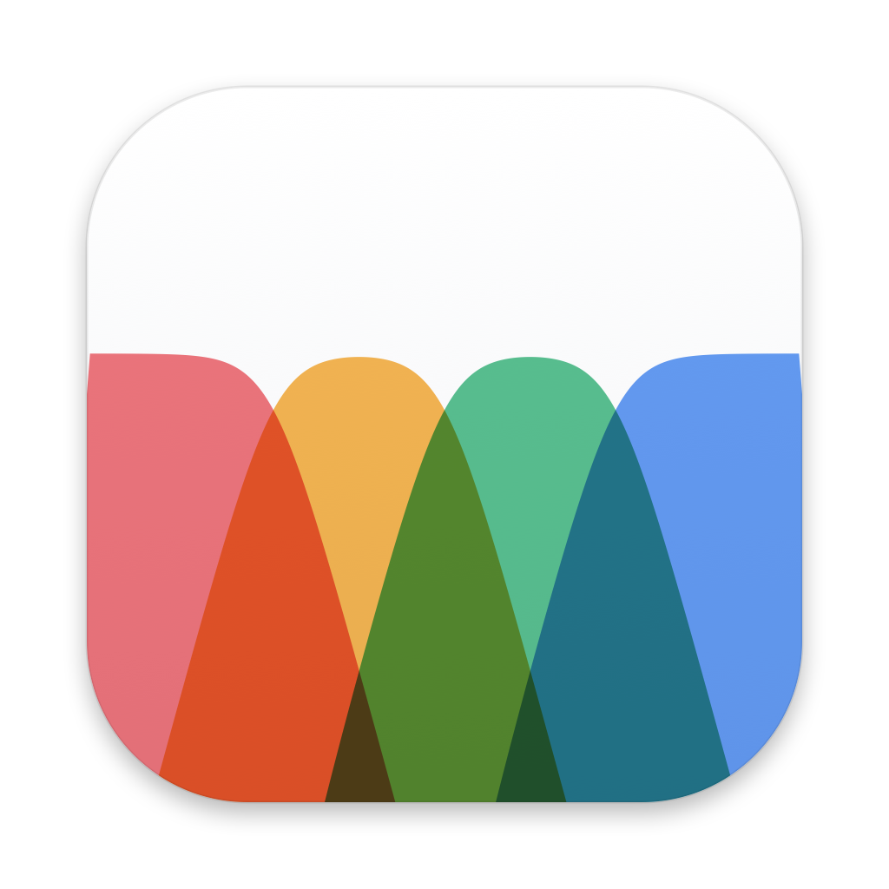
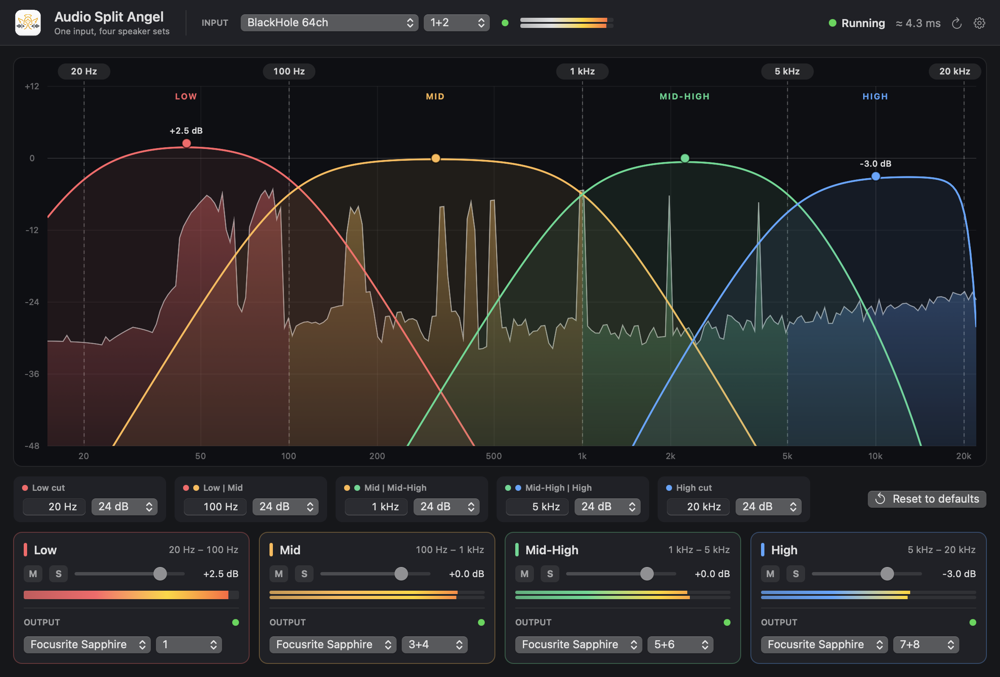

# Audio Split Angel v0.1



<sub>Rendered by the app itself (`--snapshot FILE --demo`): BlackHole 64ch in, the four
bands out to pairs of a Focusrite Sapphire, the Low band mono to channel 1.</sub>

A small Mac app that takes **one audio input** and splits it by frequency into
**four bands**, each sent to its own **output**, so every set of speakers gets only
what it's good at: the bass to the big speakers, no bass to the small ones.

| Band     | Default range     | Typical speaker          |
|----------|-------------------|--------------------------|
| Low      | 20 Hz – 100 Hz    | subwoofers               |
| Mid      | 100 Hz – 1 kHz    | mid-bass / full-range    |
| Mid-High | 1 kHz – 5 kHz     | mid drivers              |
| High     | 5 kHz – 20 kHz    | tweeters / small speakers|

Created by Philip Warda with the instrumental help of Claude Opus 5.0. Built from the
engine of [Audio Angel](https://github.com/philpiano/audio-angel).

**Requirements:** macOS 13 Ventura or later, and Apple's Command Line Tools to build it
(`xcode-select --install`; no Xcode needed). To split what the Mac itself plays, a
loopback such as [BlackHole](https://github.com/ExistentialAudio/BlackHole).

## Build

```bash
./build.sh
```

That runs the engine's tests, then makes `build/Audio Split Angel.app`. Open it and
allow microphone access when macOS asks (macOS treats every audio input as a
microphone, loopbacks too).

## Using it

- **Input** (top): the device and channels to split. To split the Mac's own sound, set
  the Mac's output to BlackHole 64ch and choose BlackHole 64ch here.
- **The display** (centre): the input's live spectrum, coloured by the band each part
  of it goes to, with each band's response drawn over it. Drag a crossover line left
  or right to move it. Drag a band's dot up or down to set its level; double-click it
  for 0 dB.
- **Edges** (under the display): every crossover's frequency (type `120`, `1.2k`…)
  and slope, plus a low cut on the Low band and a high cut on the High band (each can
  be Off). **Reset to defaults** puts the crossovers and levels back; devices stay.
- **Bands** (bottom): level, **M** mute, **S** solo, meter, and the **output**: any
  device, any stereo pair or mono channel. Several bands can share one interface
  (1+2, 3+4, 5+6, 7+8) or each go to a different device. A band pointed back into the
  loopback channels the input reads from is silenced and its dot turns red.
- **⚙**: sample rate, buffer size (64 frames by default), and which device keeps the
  clock. Closing the window doesn't stop the audio; quit from the menu bar icon.

### Slopes

All crossovers are Linkwitz-Riley (except 6 dB, first order), the standard for
speakers: at the crossover each side is −6 dB and they add back up to exactly the
input. **24 dB/oct** is the default. 6 overlaps the most, 48 is the steepest. At
12 and 36 the upper band is polarity-inverted, as Linkwitz-Riley requires at those
orders, so the speakers still add up evenly in the room.

## How it works

**One clock, one callback.** Audio Split Angel builds a hidden, private *aggregate
device* from the input device and every output device. Core Audio keeps them in step
(an interface is the master clock; the others are drift-corrected), so one callback
reads the input and writes all four outputs. Nothing is buffered in between.

**The engine is plain C** (`Sources/SplitCore`): a Linkwitz-Riley crossover tree
with all-pass phase compensation, so the four bands sum flat, electrically and
between speakers in the room. It adds **no latency**. The filters are recursive and run
sample by sample inside the callback, so the delay is only the device buffers: at
64 frames and 48 kHz, 1.3 ms per buffer plus what the devices themselves add. The audio
thread never allocates, locks or calls into Swift. Crossover moves glide (~30 ms), a
slope change dips the outputs for ~10 ms while the filters swap, and gains are
smoothed, so nothing clicks. A soft safety stage keeps every output below full scale.

**Built to stay up** (from Audio Angel): plug and unplug freely, it rebuilds by
itself; channel changes re-point in milliseconds; it rebuilds after sleep; a watchdog
restarts a stalled engine; failed builds retry with backoff; App Nap is disabled.

| File | What it does |
|---|---|
| `SplitCore/split_core.c` | The crossover, routing, meters and spectrum feed |
| `EngineController.swift` | Builds the aggregate device, maps input/bands to channels, heals itself |
| `SplitModel.swift` | App state, saving, meters, and the spectrum analyser (FFT) |
| `CrossoverGraph.swift` | The display: spectrum, band curves, dragging |
| `BandPanel.swift` | The edge controls and the four band cards |
| `Views.swift` | The window, input picker, status and settings |
| `SplitConfig.swift` | What's saved, and the first-launch guess |

## Checks

```bash
./build.sh test                                                          # engine tests, no hardware
"build/Audio Split Angel.app/Contents/MacOS/AudioSplitAngel" --list-devices
"build/Audio Split Angel.app/Contents/MacOS/AudioSplitAngel" --probe     # silent run on the speakers
"build/Audio Split Angel.app/Contents/MacOS/AudioSplitAngel" --snapshot out.png --demo
```

The engine tests check that the four bands sum back to the input (within 0.05 dB) at
every slope, that the display's curves match what the engine really does, the textbook
crossover numbers (−6 dB points, 24/48 dB per octave), separation (50 Hz stays out of
the upper bands), stereo/mono routing, gain and mute, that slope and frequency changes
don't click, garbage input, bad channel maps, meters and the spectrum feed.

## Licence

MIT. See [LICENSE](LICENSE).
